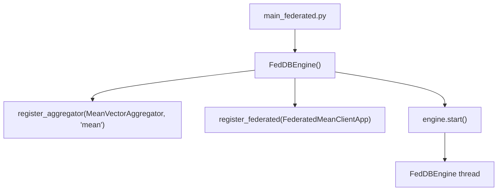
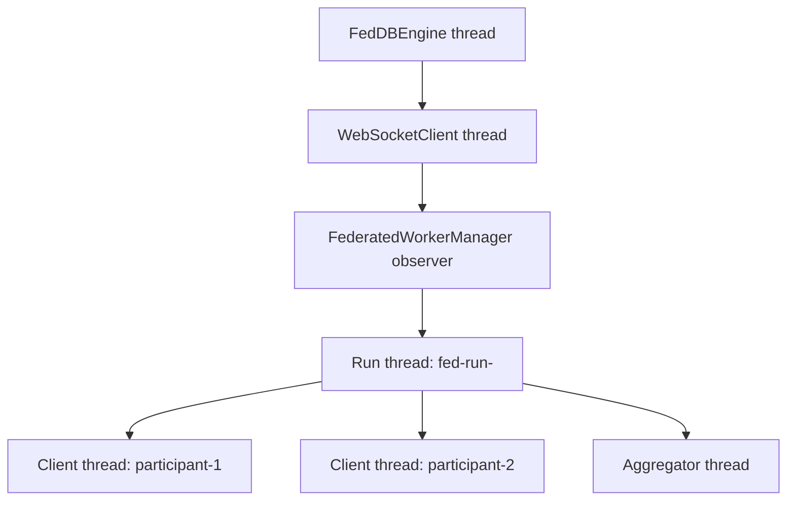
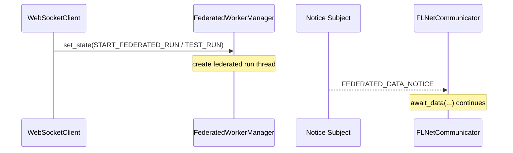
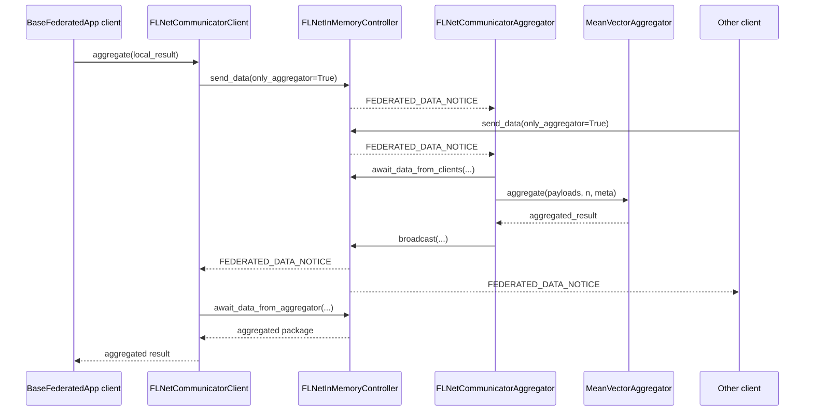
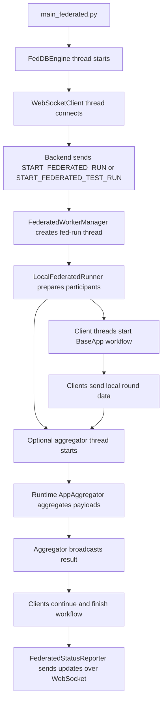

# Federated Workflow

This document explains how the federated engine starts, which thread owns which job, and how data moves between the main classes during a federated run.

The current design has two important principles:

- client logic lives in apps derived from `BaseFederatedApp`
- aggregation logic lives in runtime-owned `AppAggregator` services, not in app instances

## 1. Entry Point

The federated runtime starts in [main_federated.py](main_federated.py).

That file does four things:

1. It selects the federated config file with `system_settings.config_settings_path = "app_federated.yml"`.
2. It creates the engine with `FedDBEngine()`.
3. It registers one runtime aggregator service, for example `MeanVectorAggregator`.
4. It registers one federated app template, for example `FederatedMeanClientApp`.

After that, `engine.start()` starts the engine in its own background thread.

## 2. Main Runtime Objects

The main objects are:

- `FedDBEngine`
  Starts and owns the top-level runtime infrastructure.
- `WebSocketClient`
  Runs as a subject and forwards incoming socket events to observers.
- `FederatedWorkerManager`
  Observes the WebSocket client and starts federated runs when a federated start event arrives.
- `LocalFederatedRunner`
  Executes one federated run locally with one thread per participant.
- `BaseFederatedApp`
  Base class for client apps. It provides federated configuration and a default `FLNetCommunicatorClient`.
- `FLNetCommunicatorClient`
  Client-side API for sending local model data to the aggregator and waiting for aggregated results.
- `FLNetCommunicatorAggregator`
  Runtime-side API for waiting for client payloads, calling the registered aggregator service, and broadcasting results.
- `FederatedStatusReporter`
  Sends run state, participant state, and round-message updates back over the WebSocket.

## 3. Thread Model

The federated workflow is intentionally split into separate threads.

### Engine thread

`FedDBEngine` is itself a `threading.Thread`. Inside `run()`, it starts the shared infrastructure:

- the `WebSocketClient` thread
- optional config and system watchers
- the observer-based worker managers

### WebSocket thread

`WebSocketClient` is also a `threading.Thread`. It receives backend messages, parses them into `BaseSocketMessage`, and publishes them through the subject/observer pattern with `self.set_state(event)`.

`WorkerManager` and `FederatedWorkerManager` subscribe to this subject.

### Federated run thread

When a federated start event arrives, `FederatedWorkerManager` creates one dedicated thread for that run:

- `fed-run-<run_id>`

That thread prepares participants, stages input files, builds the local federated config, and then starts `LocalFederatedRunner`.

### Participant threads

`LocalFederatedRunner` creates:

- one thread for each client participant
- one aggregator thread if an aggregator participant exists and `startAggregator` is enabled

## 4. Start Events

The federated worker listens for two start messages:

- `START_FEDERATED_RUN`
- `START_FEDERATED_TEST_RUN`

Both are consumed by [pyfedappwrap/engine/worker/federated_worker_manager.py](pyfedappwrap/engine/worker/federated_worker_manager.py).

The flow is the same at the worker-manager level:

1. read the incoming DTO payload
2. build `FLNetLocalParticipantConfigDTO` objects
3. build `FLNetLocalTestConfigDTO`
4. start a dedicated federated run thread
5. let `LocalFederatedRunner` execute the run

The difference is the intended usage:

- `START_FEDERATED_RUN` is the normal federated start path
- `START_FEDERATED_TEST_RUN` is the local test-oriented federated start path

## 5. Aggregator Gating

The start DTO can control whether the local aggregator thread should start.

This decision is stored in `FLNetLocalTestConfigDTO.start_aggregator`, which is filled from the incoming `startAggregator` field.

The current behavior is:

- if `startAggregator` is `true`, the local runtime starts the aggregator thread
- if `startAggregator` is `false`, the aggregator thread is skipped
- if the aggregator thread is started, a runtime aggregator service must already be registered in `FedDBEngine`

This is important because aggregation is runtime-owned now. The app does not own or register aggregators anymore.

## 6. Observer Pattern

The observer pattern is used in two places.

### WebSocket start events

- `WebSocketClient` is the `Subject`
- `FederatedWorkerManager` is an `Observer`
- when a start message arrives, `WebSocketClient.handle_event()` calls `self.set_state(event)`
- `FederatedWorkerManager.update()` receives the event and starts the federated workflow

### Federated data notices

The local federated controller uses the same idea:

- `FLNetInMemoryController.notice_subject` is the `Subject`
- `FLNetCommunicator` binds a notice observer with `bind_notice_subject(...)`
- when data for a participant becomes available, a `FEDERATED_DATA_NOTICE` is published
- waiting communicators wake up and continue `await_data(...)`

This makes the local test runtime behave like the backend-driven controller model.

## 7. Client App Lifecycle

Client apps are not executed through a custom federated shortcut anymore. They use the normal `BaseApp` lifecycle.

Inside `LocalFederatedRunner` the client thread does this:

1. `configure_federation(...)`
2. load and validate the app config
3. call `set_startup(...)`
4. bind the communicator to the in-memory controller session
5. build typed input from `input_file_paths`
6. call `app.start(config, input, mode)`

Because of this, the normal app workflow is active again:

- config is loaded normally
- input and output validation still happen
- `send_output(...)` is used
- finish and status messages stay aligned with the standard app path

## 8. Communication Between Classes

The communication path for one federated round is:

1. a client app computes a local result in `run_train(...)`
2. the app uses `self.communicator.send_data_to_aggregator(...)` or `self.communicator.aggregate(...)`
3. the communicator sends the payload to the controller session
4. the controller publishes a notice for the aggregator
5. the aggregator communicator receives enough client packages with `await_data_from_clients(...)`
6. the runtime aggregator service aggregates the payloads
7. the aggregator communicator broadcasts the aggregated result back to clients
8. the clients receive the result with `await_data_from_aggregator(...)`
9. the app continues and finishes its normal workflow

## 9. Client Communication API

The main client methods are provided by `FLNetCommunicatorClient`.

### Generic methods from `FLNetCommunicator`

- `send_data(...)`
- `send_data_to_participants(...)`
- `await_data(...)`

These are the low-level primitives.

### Client-specific shortcuts

- `send_data_to_aggregator(...)`
- `await_data_from_aggregator(...)`
- `aggregate(...)`

`aggregate(...)` is the convenience method for the common round-trip:

1. send local data to the aggregator
2. wait for the aggregated answer
3. return the aggregated package

## 10. Aggregator Communication API

The runtime aggregator thread uses `FLNetCommunicatorAggregator`.

Its main responsibilities are:

- `register_aggregator(...)`
- `await_data_from_clients(...)`
- `aggregate(...)`
- `broadcast(...)`

Important detail:

- `FLNetCommunicatorAggregator.aggregate(...)` does not implement the algorithm itself
- it looks up the registered runtime `AppAggregator`
- the concrete aggregation logic is implemented by classes such as `MeanVectorAggregator`

This keeps the runtime orchestration separate from the math or aggregation strategy.

## 11. WebSocket Reporting

Federated status is sent back through `FederatedStatusReporter`.

It reports three kinds of information:

- run state with `update_run(...)` and `finish_run(...)`
- participant state with `update_participant(...)`
- round traffic with `round_message(...)`

Round-message reporting is triggered from the communicators themselves. That means:

- when a client sends data, a `SEND` round event can be emitted
- when a participant receives data, a `RECEIVE` round event can be emitted
- participant counters such as `messages_sent` and `messages_received` stay synchronized with the actual data flow

## 12. End-to-End Summary

The full runtime flow is:

In short:

- the engine starts the shared runtime
- the WebSocket triggers federated runs
- the worker manager creates one run thread
- the local runner creates one thread per participant
- apps communicate through communicator classes and the controller subject
- the aggregator is runtime-owned and independent from the app classes
- normal app lifecycle and federated round reporting both remain active
